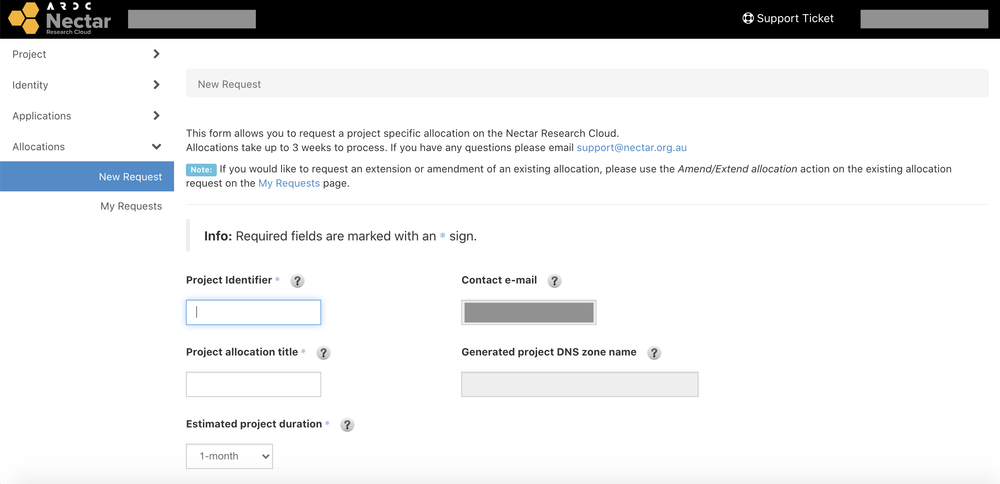
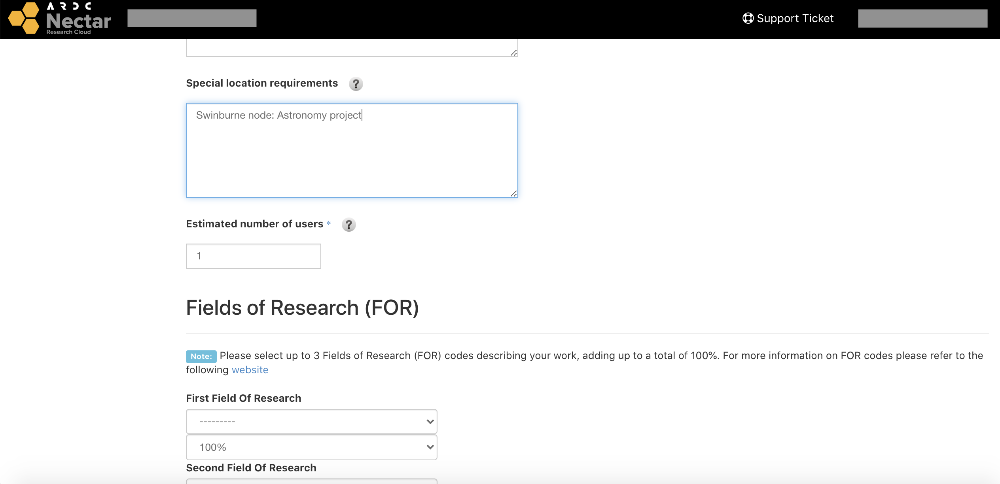

# Astronomy projects/applications

## Applications
To apply for an astronomy related project on the Swinburne node, go to the dashboard and click the `Allocations` tab on the left panel, and then select `New Request`.



Complete all the compulsory fields as you would for a standard Nectar project, and select the resources/services you will require. For most people this will be `Compute` and `Volume` services.

!!! important
    To get access to the resources of the Swinburne node (reserved for Australian astronomers), make sure to include the following in the **'Special location requirements'** field:

```text
Swinburne node: Astronomy project
```

!!! important ""
    Also, make sure to select **Swinburne** as the location if/when requesting **Volume Storage**.

---



---


This will make sure your request is viewed by the correct person, and will fast-track your application.
Following your submission, a system administrator may be in touch with you to confirm your resource requirements.

!!! Note
    The root disk on images is only 30GB, so most user will require volume storage. You should also keep in mind that volume storage is persistent, while the root disk on images is not. i.e. changes made to the root disk will be gone when you shut down your instance, unless you take a snapshot.

---

## Switching projects
Once approved, you can switch to your project from the **dashboard** via the **dropdown menu** on the **top left**.
All projects that you are a part of will be listed here, including your trial project (unless you requested to convert it).


---

## ADACS image catalogue

Projects that are approved as a Swinburne allocation will also have access to a number of images provided by ADACS. These images are based off a public Nectar Ubuntu image, but come with extra software installed to help users get up and running faster.


### Public images
These images are available to anyone. You can find them via the search box when [launching](launching-instance.md#source) an image.

- [ADACS - Ubuntu 18.04 LTS (Bionic) amd64](#adacs-ubuntu-1804-lts-bionic-amd64)
- [ADACS Astronomy A - Ubuntu 18.04 LTS (Bionic) amd64](#adacs-astronomy-a-ubuntu-1804-lts-bionic-amd64)
- [ADACS Astronomy B - Ubuntu 18.04 LTS (Bionic) amd64](#adacs-astronomy-b-ubuntu-1804-lts-bionic-amd64)


#### ADACS - Ubuntu 18.04 LTS (Bionic) amd64
This basic image includes build essentials, such as git, make, gcc, g++, gfortran, etc, (which are not included by default on the corresponding 'bare-bones' Nectar image). It also has an Anaconda (conda) installation of Python 3, bundled with common packages like numpy, astropy, tensorflow, matplotlib and more.

!!! Note
    The base conda environment is not loaded on login. To activate it, type `conda activate`.


#### ADACS Astronomy A - Ubuntu 18.04 LTS (Bionic) amd64
Same as the basic image, but also includes installations of these common astronomy tools:

- SAOImage DS9
- SExtractor (Source-Extractor)
- fv (ftools FITS viewer)
- PyWiFeS
- Tempo2
- Fermitools
- STScI/STSDAS/Astroconda
- IRAF/PyRAF
- DRAGONS/Gemini IRAF

Many of the tools are installed in conda environments:

```text
$ conda env list
   # conda environments:
   #
   base                  *  /home/ubuntu/conda
   astroconda               /home/ubuntu/conda/envs/astroconda
   dragons                  /home/ubuntu/conda/envs/dragons
   fermi                    /home/ubuntu/conda/envs/fermi
   geminiconda              /home/ubuntu/conda/envs/geminiconda
   iraf27                   /home/ubuntu/conda/envs/iraf27
   pywifes                  /home/ubuntu/conda/envs/pywifes

$ conda activate pywifes
(pywifes) $
```


#### ADACS Astronomy B - Ubuntu 18.04 LTS (Bionic) amd64
Same as the basic image, but also includes installations of these common astronomy tools:

- SAOImage DS9
- SExtractor (Source-Extractor)
- fv (ftools FITS viewer)
- HEASoft/Xspec
- SAS (XMM-Newton)
- CIAO & CALDB

!!! Note
    The conda installation included with SAS is an older version (4.3). This means that the command `conda init` implemented in newer versions (4.6.12 and later) is not availabe, and thus the other conda commands are not available unless a conda environment has already been activated. To activate the default environment, type `conda_activate`, which is an alias for `source <path to conda>/bin/activate`.

---

### Images with licensed software
These images contain licensed/proprietary software. Please contact <openstack@adacs.org.au> to get access.

- [ADACS (with IDL) - Ubuntu 18.04 LTS (Bionic) amd64](#adacs-with-idl-ubuntu-1804-lts-bionic-amd64)
- [ADACS (with Intel) - Ubuntu 18.04 LTS (Bionic) amd64](#adacs-with-intel-ubuntu-1804-lts-bionic-amd64)
- [ADACS (with Mathematica) - Ubuntu 18.04 LTS (Bionic) amd64](#adacs-with-mathematica-ubuntu-1804-lts-bionic-amd64)
- [ADACS (with MATLAB) - Ubuntu 18.04 LTS (Bionic) amd64](#adacs-with-matlab-ubuntu-1804-lts-bionic-amd64)
- [ADACS (with Intel + IDL + Conda) - Ubuntu 18.04 LTS (Bionic) amd64](#adacs-with-intel-idl-conda-ubuntu-1804-lts-bionic-amd64)
- [ADACS Astronomy A (with Intel + IDL) - Ubuntu 18.04 LTS (Bionic) amd64](#adacs-astronomy-a-with-intel-idl-ubuntu-1804-lts-bionic-amd64)


#### ADACS (with IDL) - Ubuntu 18.04 LTS (Bionic) amd64
Includes a full installation of IDL 8.4, along with the following astronomy IDL packages:

- IDL Astronomy Users Library
- SDSS IDL utilities
- SDSS IDL spec2d pipeline


#### ADACS (with Intel) - Ubuntu 18.04 LTS (Bionic) amd64
Includes an installation of Intel Parallel Studio XE 2018. This gives you access to the following proprietary tools:

- Intel C++ Compiler (`icc`)
- Intel Fortran Compiler (`ifort`)
- Intel Math Kernel Library (for C/C++ and Fortran)
- GNU Project Debugger (`gdb-ia`), enhanced by Intel
- Intel Integrated Performance Primitives
- Intel Threading Building Blocks
- Intel Data Analytics Acceleration Library
- Intel Debugger for Heterogeneous Compute
- Intel Many Integrated Core (MIC) Debugger


#### ADACS (with Mathematica) - Ubuntu 18.04 LTS (Bionic) amd64
Includes a full installation of Mathematica 11.2.0.


#### ADACS (with MATLAB) - Ubuntu 18.04 LTS (Bionic) amd64
Includes an installation of MATLAB R2019b, along with the following products:

- Parallel Computing Toolbox
- Curve Fitting Toolbox
- Optimization Toolbox
- Global Optimization Toolbox
- Symbolic Math Toolbox
- Partial Differential Equation Toolbox
- Statistics and Machine Learning Toolbox
- Deep Learning Toolbox
- Reinforcement Learning Toolbox
- Predictive Maintenance Toolbox
- MATLAB Coder
- Embedded Coder
- Fixed Point Designer
- GPU Coder
- MATLAB Compiler
- MATLAB Compiler SDK
- Database Toolbox
- MATLAB Report Generator
- Signal Processing Toolbox
- Phased Array System Toolbox
- DSP System Toolbox
- Audio Toolbox
- Wavelet Toolbox
- Image Processing Toolbox
- System Identification Toolbox

!!! Note
    Contact <openstack@adacs.org.au> if you require MATLAB products that are not in this list.

#### ADACS (with Intel + IDL + Conda) - Ubuntu 18.04 LTS (Bionic) amd64
As the name suggests, this image is a combination of the [basic](#adacs-ubuntu-1804-lts-bionic-amd64) image with the [Intel](#adacs-with-intel-ubuntu-1804-lts-bionic-amd64) and [IDL](#adacs-with-idl-ubuntu-1804-lts-bionic-amd64) images above.

#### ADACS Astronomy A (with Intel + IDL) - Ubuntu 18.04 LTS (Bionic) amd64
As the name suggests, this image is a combination of the [Astronomy A](#adacs-astronomy-a-ubuntu-1804-lts-bionic-amd64) image with the [Intel](#adacs-with-intel-ubuntu-1804-lts-bionic-amd64) and [IDL](#adacs-with-idl-ubuntu-1804-lts-bionic-amd64) images above.
