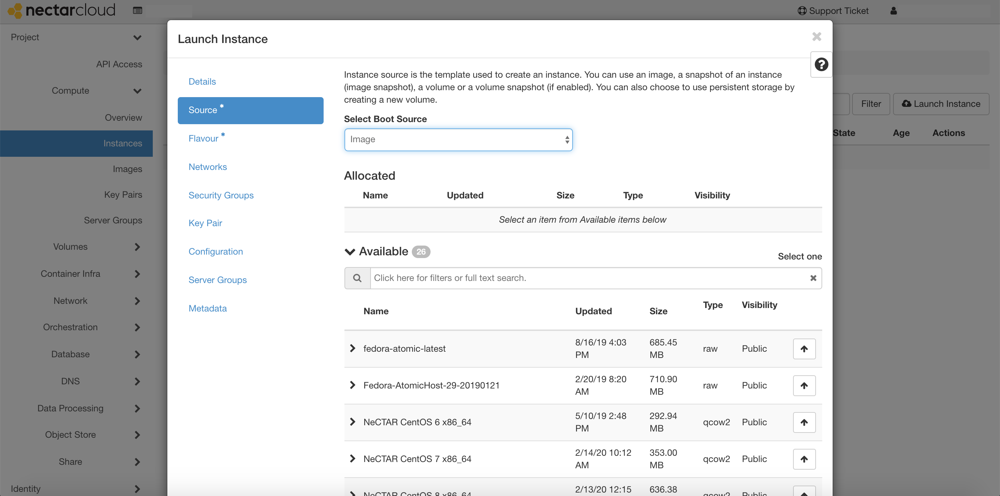
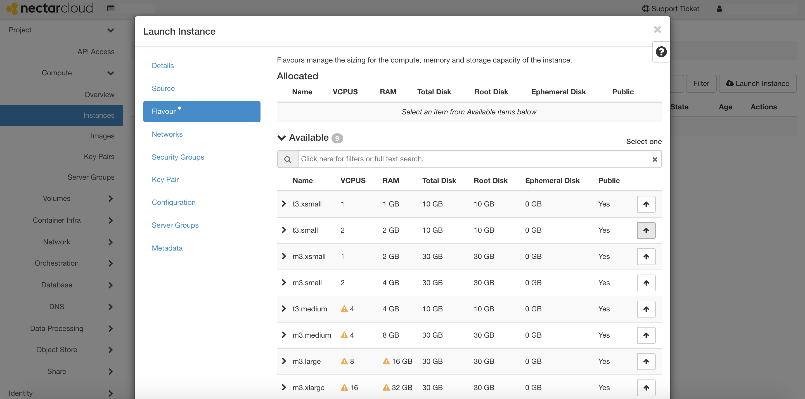

# Launching an instance
Now that you have up a key pair set up, we can launch an instance -- i.e. a virtual machine (VM).

### Details
On the left panel of the dashboard select the `Compute` tab, then select `Instances`. Here is where you will see and be able to manage any instances (VMs) that you have created. To create a new one press the `Launch Instance` button to bring up a 'Wizard'.

Give your instance a name and description. Leave the availability zone on `Any Availability Zone`, which allows Nectar to choose automatically, and leave the `Count` field on `1` since we are only making a single instance.

### Source
After pressing `Next` you can choose the source to create your instance from.

We will boot from one of the base images that are provided on Nectar. Let's select the image with the latest Ubuntu release `NeCTAR Ubuntu 19.10 (Eoan) amd64` (at the time of this writing) by scrolling down and pressing the up arrow button next to it. Then scroll down and press next.

### Flavour
We now get to choose a 'flavour' for our instance, which is basically a choice of sizing for the compute, memory and storage capacity of the VM. What you can select depends on your project quota, but everyone with a trial project should be able to use one of the small flavours.

Let's select `t3.small` by pressing the up arrow button next to it.

### Security Groups
Next, press `Security Groups` on the left panel, and select `ssh` to allow SSH connections in your virtual machine.

!!! note
    If you forget to do this, you can always add a security group to your instance after it has launched.

### Key Pair
Finally, let's add the SSH Key to our virtual machine.

!!! attention
    Make sure you do this step, otherwise you won't be able to access your virtual machine! You cannot add a key to your instance once it has been launched.

Press `Key Pair` from the panel on the left, and make sure that the key you made earlier is in the 'allocated' list. If it's not then select it from the 'available' list.

### Launch
Now press `Launch Instance` and wait for your Virtual Machine to spin up!

In the dashboard, in the `Compute > Instances` pane, you should see your VM, and its status/state. You might have to wait a few minutes for it to build. You will know when it's done once it says `Active` in the status column.

!!! warning "Note"
    If there is an error starting your VM, you may have to delete your broken instance and launch a new one.
