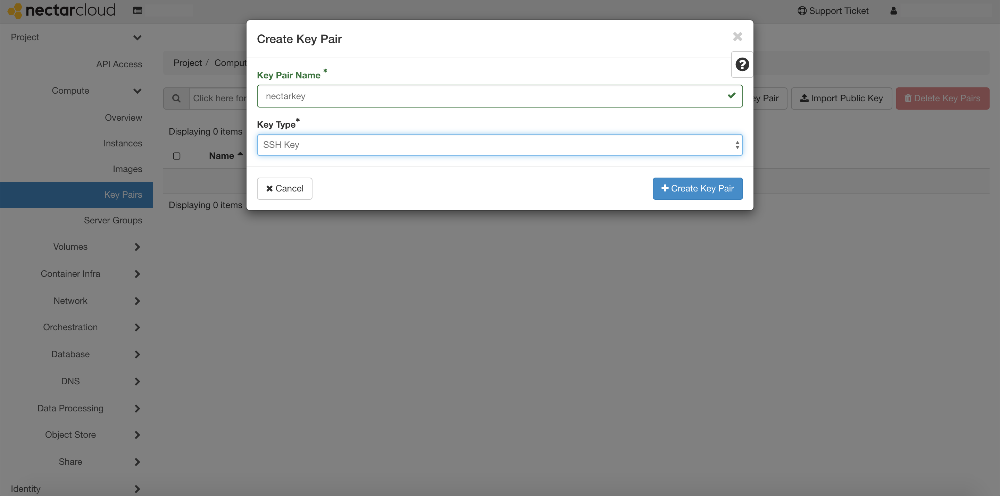

# Setting an SSH key

!!! note
    Nectar images are set up to be passwordless by default, and thus can only be accessed via a cryptographically signed public and private key set.

To set and SSH key-pair, click the `Compute` tab on the left panel, and then select `Key Pairs`.


Here, you can either:

1. create a new SSH key pair; or
2. import an existing public key on your local machine

### Create new key
To create a new key-pair, press `+ Create Key Pair`. Give your key a name and select SSH Key for the Key Type. Then press the `Create Key Pair` button.



This will download a private key to your downloads folder with the suffix `.pem`.

It is good practice to store the key in the `~/.ssh` directory. To move the key, open a terminal and type

```console
mv ~/Downloads/nectarkey.pem ~/.ssh/.
```

Then, change its permissions to be more secure by typing

```console
chmod 600 ~/.ssh/nectarkey.pem
```

### Import existing key
**Alternatively**, if you already have a public key on your local machine that you wish to use, you can import it by pressing `Import Public Key`.
Give the key a name, select SSH Key as the 'key type' and either paste the public key in the text box or click 'choose file' and select it in the file manager.

!!! danger
    Make sure you are copying your **PUBLIC** key (should have the extension `.pub`) and not your **PRIVATE** key!

!!! info "See also"
    For a more detailed explanation of key-pair authentication for the Nectar research cloud, see the [SSH key tutorial page](http://training.nectar.org.au/package07/sections/createSSHKey.html).